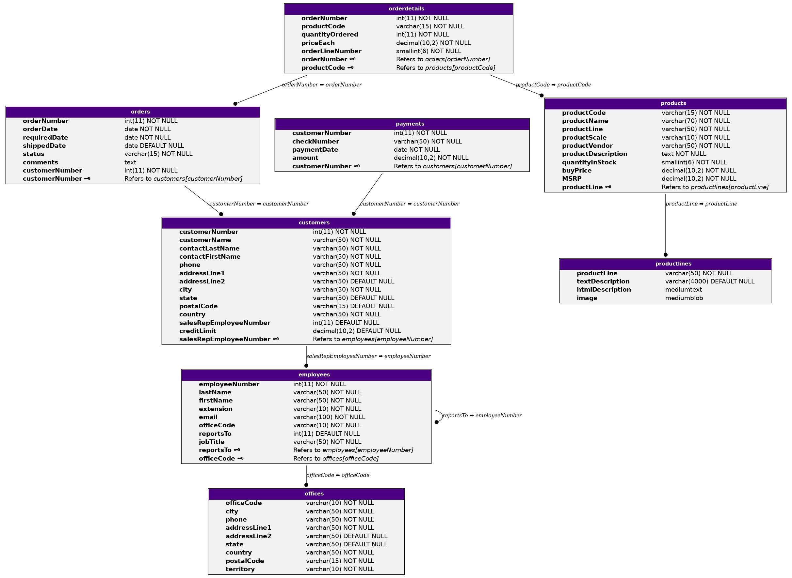

## Doteur

A simple tool to draw your mysql relations from exports.



#### Help us

If you use the tool, and like it, don't forget to add a star to the project on GitHub :star:, it helps us to keep motivation to improve it.

If you have any suggestion, or issue, please report it, it will help us to fix them.

#### General information

- <u>Author :</u> LABEYE Loïc
- <u>Licence :</u> MIT
- <u>Platforms available :</u>
	- Linux
		- [X] Tested
	- Windows
		- [X] Tested
	- Darwin
		- [ ] Untested

#### How to install

0. **Optional but highly recommended**

First install graphviz.

On Linux, use your default package manager.

Example on ubuntu :

```
usr@ubuntu:~$ sudo apt-get install graphviz
```

On Windows, use winget or the default graphviz installer.

You can still refer to the [graphviz download page](https://graphviz.org/download/).

*The tool uses graphviz libraries to render in other formats than .dot, if graphviz is not installed or you do not want to install it, you can still use this [tool](https://dreampuf.github.io/GraphvizOnline/) and pass it your output file*.

1. Download the tool

- Via the release page.

- Via github

```bash
git clone https://github.com/nag763/doteur
cd doteur
cargo build --release
```

- Use the tool

```bash
./doteur --help
# if you installed it through github
./target/release/doteur --help
```

3. Add it to your path

If you need to use it regularly, it is recommended to add the bin folder to your path. For this, look on how to do it on your distro.

#### Cli usage

```bash
usr@pop-os:~$ doteur --help

doteur 0.1
LABEYE Loïc
Convert .sql files to .dot files

USAGE:
    doteur [OPTIONS] <FILENAME>

FLAGS:
    -h, --help       Prints help information
    -V, --version    Prints version information

OPTIONS:
    -o <output>        The output filename

ARGS:
    <FILENAME>    File of the sql name
```

#### Example usage

##### Export a .sql file to a .dot

```bash
usr@pop-os:~$ doteur sample.sql
```

The output will be in the output.dot

##### Export a .sql file to a .png

```bash
usr@pop-os:~$ doteur sample.sql -o output.png
```

The output will be in a png file.

For the format supported, please refer to the graphviz [documentation](https://graphviz.org/doc/info/output.html)

