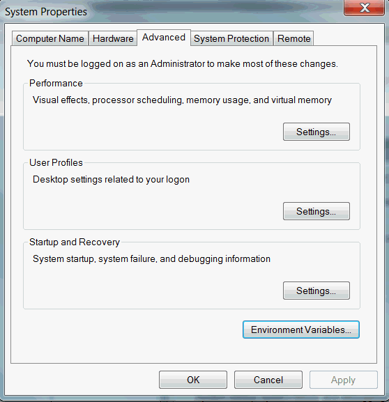

**Since the version 0.5.0, doteur is shipped with in several packages, for more information check the [features](../features) section**

## Prerequisites

It is required to install Graphviz in order to get the best from this tool.

Please check the installation guide of Graphviz [here](https://graphviz.org/download/#windows) and fullfill it prior going further.

## First step : download the tool

See the download list [here](../downloads)

And unzip it.

## Second step : Move the tool

It is better to not let the tool in your Downloads folder following its extraction, move it to somewhere you could retrieve it easier.

### Finally, add the tool to your system path

Open your environment variables editor :



And click on environment variables, you should now see this interface :


Navigate to the variable `Path` in the second panel and click on `Edit` :


Click on new and put the path to the root of the folder that contains the `doteur.exe` binary.


You should now be done ! Open a new cmd session and ensure that the tool is in your path :

```
doteur --help
```

It should print the help guide of the tool.

Now that you are done, check the [Usage section](../usage).
